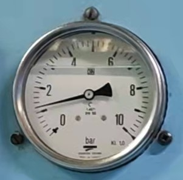
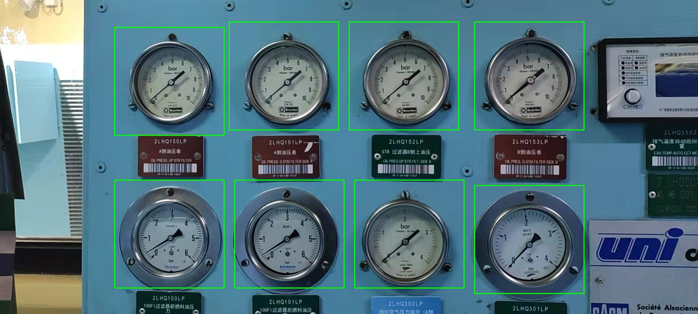
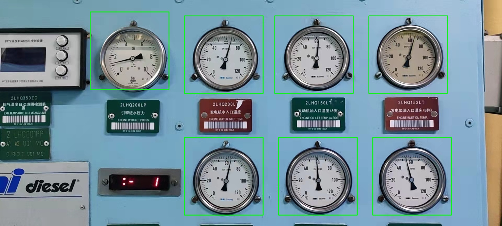
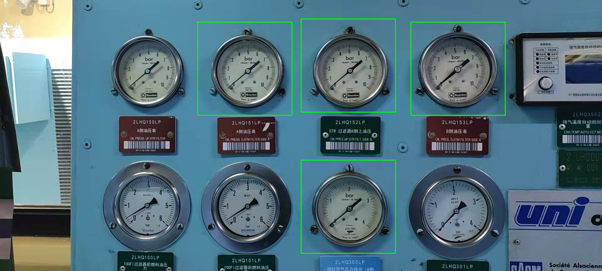
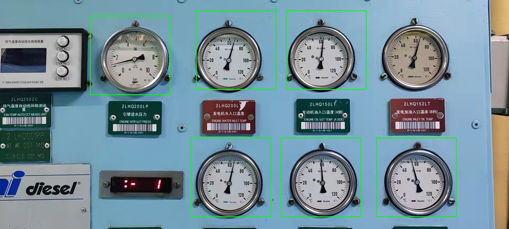
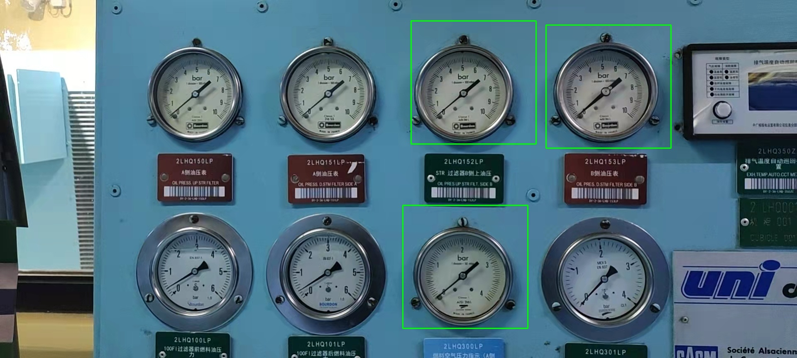
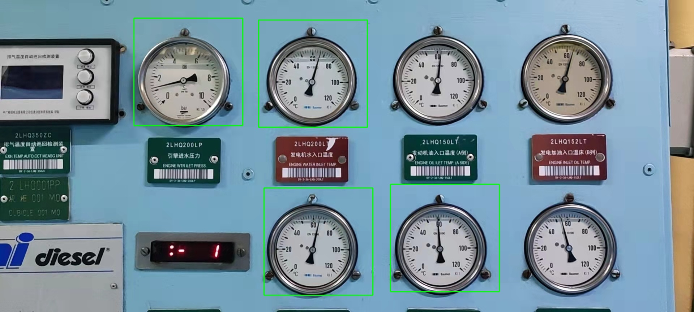

# 图像搜索报告（仪表盘）


## 任务描述：

在本次任务中，我们需要从给出的图片中，精确识别出仪表盘的位置信息，并使用矩形框将仪表盘的位置标注出来。

考虑到我们并没有大量的仪表盘的图像信息作为模型的训练数据集，无法直接构建模型，用于识别。所以我们可以采用计算机视觉的相关内容，来完成该部分的任务。

通过查阅相关的资料发现，对于图像搜索任务，我们可以使用基于特征匹配的方法，基于深度学习的方法，基于哈希编码的方法等多种方案，接下来我们将依次使用这些方案来实现仪表盘的识别。

## 前期准备：

我们从给出的待搜索的图片中，截取仪表盘的图片，用于提取仪表盘的图像特征，用于后续的识别过程。

待搜索图片如下：


提取出的仪表盘图片如下：



## 解决过程：

### 传统的机器学习方法

首先，我们尝试调用`opencv`库，使用传统的机器学习方法来解决该任务。

我们需要分别使用`cv2.imread`函数，读取图片，然后使用`cv2.matchTemplate`函数，在待搜索图片中查找目标图片匹配的位置，最后我们通过相似度来筛选出合适的匹配位置，并且在保证匹配位置不重复的情况下，使用矩形框将这些匹配的位置标注出来。

```
import copy
import cv2
import matplotlib.pyplot as plt
import numpy as np
import os

os.environ['KMP_DUPLICATE_LIB_OK'] = 'True'


def image_recognition_test(mask, threshold):  # mask为掩码,threshold为阈值
    target_image_path = './img/target.jpg'

    target_image = cv2.imread(target_image_path)  # 读取目标图片  

    for file in os.listdir('./img/picture'):
        image_path = os.path.join('./img/picture', file)
        source_image = cv2.imread(image_path)  # 读取待搜索图片

        # 在待搜索图片中搜索目标图片
        res = cv2.matchTemplate(cv2.cvtColor(source_image, cv2.COLOR_BGR2GRAY), cv2.cvtColor(target_image, cv2.COLOR_BGR2GRAY), cv2.TM_CCOEFF_NORMED)
        
        threshold = 0.28
        locations = np.where(res >= threshold)

        # 复制待搜索图片并在复制的图片上画矩形框
        search_image_with_boxes = copy.deepcopy(source_image)
        matched_locations = []
        for loc in zip(*locations[::-1]):  # *号表示可选参数
            top_left = (loc[0], loc[1])  # 左上角,loc[0]为x坐标,loc[1]为y坐标
            bottom_right = (loc[0] + target_image.shape[1], loc[1] + target_image.shape[0])  # 右下角,loc[0]为x坐标,loc[1]为y坐标

            # 检查当前位置是否与已标注的位置重叠,如果重叠则跳过,否则将当前位置标注
            overlapping = False  # 是否重叠
            for prev_top_left, prev_bottom_right in matched_locations:  # 遍历已标注的位置
                if top_left[0] < prev_bottom_right[0] and bottom_right[0] > prev_top_left[0] and \
                        top_left[1] < prev_bottom_right[1] and bottom_right[1] > prev_top_left[1]:
                    overlapping = True
                    break

            if not overlapping:
                cv2.rectangle(search_image_with_boxes, top_left, bottom_right, (0, 255, 0), 2)
                matched_locations.append((top_left, bottom_right))
                print(loc)

        # 保存结果
        cv2.imwrite('./img/result/' + file, search_image_with_boxes)
        print('图片' + file + '已保存')


if __name__ == '__main__':
    image_recognition_test()

```

考虑到该匹配过程存在多种不同的匹配方法，并且不同的相似度条件下，得到的匹配结果可能存在区别，我们分别对掩码和阈值的不同组合进行输出。修改上述代码如下：

```
import copy
import cv2
import numpy as np
from tensorflow import keras
import os

os.environ['KMP_DUPLICATE_LIB_OK'] = 'True'  # 允许重复加载库


def image_recognition_test(mask, threshold):  # mask为掩码,threshold为阈值
    target_image_path = './img/target.jpg'

    model = keras.applications.ResNet50(weights='imagenet', include_top=False, pooling='avg')  # 加载ResNet模型

    target_image = cv2.imread(target_image_path)  # 读取目标图片

    count = 0  # 计数器,用于记录已处理的图片数量
    for file in os.listdir('./img/picture'):
        image_path = os.path.join('./img/picture', file)
        source_image = cv2.imread(image_path)  # 读取待搜索图片

        # 在待搜索图片中搜索目标图片
        res = cv2.matchTemplate(cv2.cvtColor(source_image, cv2.COLOR_BGR2GRAY), cv2.cvtColor(target_image, cv2.COLOR_BGR2GRAY), mask)

        locations = np.where(res >= threshold)

        # 复制待搜索图片并在复制的图片上画矩形框
        search_image_with_boxes = copy.deepcopy(source_image)
        matched_locations = []
        for loc in zip(*locations[::-1]):  # *号表示可选参数
            top_left = (loc[0], loc[1])  # 左上角,loc[0]为x坐标,loc[1]为y坐标
            bottom_right = (loc[0] + target_image.shape[1], loc[1] + target_image.shape[0])  # 右下角,loc[0]为x坐标,loc[1]为y坐标

            # 检查当前位置是否与已标注的位置重叠,如果重叠则跳过,否则将当前位置标注
            overlapping = False  # 是否重叠
            for prev_top_left, prev_bottom_right in matched_locations:  # 遍历已标注的位置
                if top_left[0] < prev_bottom_right[0] and bottom_right[0] > prev_top_left[0] and \
                        top_left[1] < prev_bottom_right[1] and bottom_right[1] > prev_top_left[1]:
                    overlapping = True
                    break

            if not overlapping:
                count += 1
                cv2.rectangle(search_image_with_boxes, top_left, bottom_right, (0, 255, 0), 2)
                matched_locations.append((top_left, bottom_right))

        # 保存结果
        cv2.imwrite('./img/result/' + file, search_image_with_boxes)
        print('图片' + file + '已保存')

    print('共处理了' + str(count) + '张图片')
    print('mask:' + str(mask) + ' threshold:' + str(threshold) + ' count:' + str(count))


if __name__ == '__main__':
    masks = [cv2.TM_SQDIFF, cv2.TM_SQDIFF_NORMED, cv2.TM_CCORR, cv2.TM_CCORR_NORMED, cv2.TM_CCOEFF, cv2.TM_CCOEFF_NORMED]
    thresholds = [0.9, 0.8, 0.7, 0.6, 0.5, 0.4, 0.3, 0.2]
    for mask in masks:
        for threshold in thresholds:
            image_recognition_test(mask, threshold)

```

运行结果显示，当匹配方式选择`cv2.TM_CCOEFF_NORMED`时，得到的识别效果最好，同时，当阈值为`0.2~0.3`时，识别的正确性最高，对于第一张图片均能正常识别，对于第二张图片，阈值为0.3时，结果会缺少一个；阈值为0.2时，能正确识别。接下来，我们在`0.2~0.3`之前找到恰好能正确识别的最大阈值。

需要修改的代码部分如下：

```
if __name__ == '__main__':
    methods = [cv2.TM_CCOEFF_NORMED]
    thresholds = [0.2, 0.21, 0.22, 0.23, 0.24, 0.25, 0.26, 0.27, 0.28, 0.29, 0.3]
    for method in methods:
        for threshold in thresholds:
            image_recognition_test(method, threshold)
```

结果显示，最佳的阈值为0.28，识别结果如下：


### 基于深度学习的方法

我们尝试引入深度学习模型，用于提取图像的特征，使用基于深度学习的方法来实现识别过程。

1. 加载并预处理ResNet模型：使用ResNet50模型对图像进行特征提取。
2. 读取目标图像和待搜索图片：从指定路径读取目标图像和待搜索图片。
3. 提取目标图像的特征：将目标图像调整为模型输入尺寸，然后通过ResNet模型提取目标图像的特征。
4. 滑动窗口搜索：在待搜索图片中使用滑动窗口的方式进行搜索，窗口大小与目标图像相同，步长为10。
5. 计算特征相似度：对于每个滑动窗口，将窗口的图像也调整为模型输入尺寸，然后通过ResNet模型提取窗口的特征。计算目标图像的特征与窗口特征之间的余弦相似度。
6. 匹配相似区域：如果相似度较高（大于0.55），则将当前窗口的位置和相似度保存到similar_regions列表中。
7. 标注匹配结果：在待搜索图片的副本上，根据similar_regions列表中保存的位置信息，在相应位置上画矩形框，并打印相似度和位置信息。
8. 保存结果：将带有标注框的待搜索图片保存到指定路径。

```
import os
import cv2
import numpy as np
from tensorflow import keras
from scipy.spatial.distance import cosine
import matplotlib.pyplot as plt

os.environ['KMP_DUPLICATE_LIB_OK'] = 'True'


def model_test():
    # 加载并预处理ResNet模型
    model = keras.applications.ResNet50(weights='imagenet', include_top=False)

    # 加载目标图像和待搜索图片
    target_image_path = './img/target.jpg'
    search_image_path = './img/picture/picture1.jpg'

    # 读取图像
    target_image = cv2.imread(target_image_path)
    # 将图像从BGR格式转换为RGB格式
    target_image = cv2.cvtColor(target_image, cv2.COLOR_BGR2RGB)
    # 调整图像大小为模型输入尺寸
    target_image_resized = cv2.resize(target_image, (224, 224))
    # 预处理图像数据
    target_image_preprocessed = keras.applications.resnet50.preprocess_input(target_image_resized[np.newaxis, :])
    # 提取目标图像的特征
    target_features = model.predict(target_image_preprocessed).flatten()

    for file in os.listdir('./img/picture'):
        image_path = os.path.join('./img/picture', file)
        search_image = cv2.imread(image_path)  # 读取待搜索图片

        # 将图像从BGR格式转换为RGB格式
        search_image = cv2.cvtColor(search_image, cv2.COLOR_BGR2RGB)

        window_size = (target_image.shape[1], target_image.shape[0])  # 窗口大小与目标图像相同
        stride = 20  # 滑动窗口的步长

        similar_regions = []  # 保存相似度较高的区域

        for (x, y, window) in sliding_window(search_image, window_size, stride):
            # 调整窗口大小为模型输入尺寸
            window_resized = cv2.resize(window, (224, 224))
            window_preprocessed = keras.applications.resnet50.preprocess_input(window_resized[np.newaxis, :])

            # 提取窗口的特征
            window_features = model.predict(window_preprocessed).flatten()
            # 计算特征相似度
            similarity = 1 - cosine(target_features, window_features)
            # 如果相似度较高，则保存窗口位置和相似度
            if similarity > 0.5:
                similar_regions.append((x, y, similarity))

        # 复制待搜索图片并在复制的图片上画矩形框
        search_image_with_boxes = search_image.copy()
        matched_locations = []
        for x, y, similarity in similar_regions:
            top_left = (x, y)
            bottom_right = (x + target_image.shape[1], y + target_image.shape[0])

            # 检查当前位置是否与已标注的位置重叠,如果重叠则跳过,否则将当前位置标注
            overlapping = False
            for prev_top_left, prev_bottom_right in matched_locations:
                if top_left[0] < prev_bottom_right[0] and bottom_right[0] > prev_top_left[0] and \
                        top_left[1] < prev_bottom_right[1] and bottom_right[1] > prev_top_left[1]:
                    overlapping = True
                    break

            if not overlapping:
                cv2.rectangle(search_image_with_boxes, top_left, bottom_right, (0, 255, 0), 2)
                print(f'Found similar region with similarity {similarity} at {top_left}')
                matched_locations.append((top_left, bottom_right))

        # 保存结果
        search_image_with_boxes = cv2.cvtColor(search_image_with_boxes, cv2.COLOR_RGB2BGR)
        cv2.imwrite('./img/result/' + file, search_image_with_boxes)
        pass


def sliding_window(image, window_size, stride):
    for y in range(0, image.shape[0] - window_size[1], stride):
        for x in range(0, image.shape[1] - window_size[0], stride):
            yield x, y, image[y:y + window_size[1], x:x + window_size[0]]


if __name__ == '__main__':
    model_test()

```

运行结果：


我们注意到，在上述代码中，有两个值对识别的结果影响较大，分别是滑动窗口的步长和相似度的阈值。步长减小可以有效提升识别效果，但是时间成本会增加。阈值增大可以提高准确度，但是可能出现无法识别的情况，由于阈值在一定程度上会受到滑动窗口步长的影响，所以，我们尝试在增大阈值的同时，减小滑动窗口的步长，保证能够准确识别出目标图像。

我们尝试单独提升阈值至0.6，滑动窗口的步长保持不变，为20：


此时，我们发现存在一个仪表盘的位置信息没有识别出来，接下来我们尝试适当减小阈值。

我们将阈值提升到0.6，并同时将滑动窗口的步长减小到15：




结果显示，滑动窗口的步长减小，使得原本无法识别出来的仪表盘被识别出来，接下来，我们在保持滑动窗口的步长不变，为15，阈值增大到0.65，观察得到的识别结果：




结果显示，增大阈值会导致部分需要识别出来的仪表盘无法被识别出来，为了解决这一问题，我们接下来保持阈值不变，为0.65，减小滑动窗口的步长至10，分析识别结果：




运行结果显示，在减小滑动窗口的步长后，识别结果并无较大变化，说明，剩下的未识别出的区域和我们选定的目标图片的相似度较低，为保证识别的准确性，我们可以将识别的相似度阈值和滑动窗口的步长设定为效果较好的值，即相似度阈值为0.6，滑动窗口的步长设置为15。


相较于传统的机器学习方法，使用深度学习模型提取图像的特征后，识别图象时，能够保证识别准确性的最大阈值有了明显的增大，说明使用深度学习模型提取特征的效果较好。但是，使用深度学习模型提取特征后，识别出图像所用的时间有了明显的增加。

### 基于哈希值的方法

我们对目标图像和待搜索的图像，基于哈希值提取特征，并使用哈希值的汉明距离来计算图像的相似度，并标注出相似度较高的位置。

```
import os
import cv2
import numpy as np
from scipy.spatial.distance import hamming

os.environ['KMP_DUPLICATE_LIB_OK'] = 'True'


def image_hash(target_image):
    # 将图像转换为16*16
    target_image = cv2.resize(target_image, (16, 16))
    # 将图像转换为灰度图
    target_image = cv2.cvtColor(target_image, cv2.COLOR_BGR2GRAY)
    # 计算图像的平均灰度
    average = np.mean(target_image)
    # 将图像转换为二值图
    target_image = (target_image > average) * 1.00
    # 将二值图转换为哈希值
    target_image_hash = []
    for row in target_image.tolist():
        for i in row:
            target_image_hash.append(int(i))
    return target_image_hash
    pass


def model_hash_test():
    # 加载目标图像和待搜索图片
    target_image_path = './img/target.jpg'

    # 读取图像
    target_image = cv2.imread(target_image_path)
    # 计算图像的哈希值
    target_image_hash = image_hash(target_image)

    for file in os.listdir('./img/picture'):
        image_path = os.path.join('./img/picture', file)
        search_image = cv2.imread(image_path)  # 读取待搜索图片

        window_size = (target_image.shape[1], target_image.shape[0])  # 窗口大小与目标图像相同
        stride = 20  # 滑动窗口的步长

        similar_regions = []  # 保存相似度较高的区域

        for (x, y, window) in sliding_window(search_image, window_size, stride):
            # 计算窗口的哈希值
            window_hash = image_hash(window)
            # 计算哈希值的汉明距离,并计算相似度,汉明距离越小,相似度越高
            similarity = 1 - hamming(list(window_hash), list(target_image_hash))
            # 如果相似度较高，则保存窗口位置和相似度
            if similarity > 0.7:
                similar_regions.append((x, y, similarity))

        # 复制待搜索图片并在复制的图片上画矩形框
        search_image_with_boxes = search_image.copy()
        matched_locations = []
        for x, y, similarity in similar_regions:
            top_left = (x, y)
            bottom_right = (x + target_image.shape[1], y + target_image.shape[0])

            # 检查当前位置是否与已标注的位置重叠,如果重叠则跳过,否则将当前位置标注
            overlapping = False
            for prev_top_left, prev_bottom_right in matched_locations:
                if top_left[0] < prev_bottom_right[0] and bottom_right[0] > prev_top_left[0] and \
                        top_left[1] < prev_bottom_right[1] and bottom_right[1] > prev_top_left[1]:
                    overlapping = True
                    break

            if not overlapping:
                cv2.rectangle(search_image_with_boxes, top_left, bottom_right, (0, 255, 0), 2)
                print(f'Found similar region with similarity {similarity} at {top_left}')
                matched_locations.append((top_left, bottom_right))

        # 保存结果
        cv2.imwrite('./img/result/' + file, search_image_with_boxes)
        pass


def sliding_window(image, window_size, stride):
    for y in range(0, image.shape[0] - window_size[1], stride):
        for x in range(0, image.shape[1] - window_size[0], stride):
            yield x, y, image[y:y + window_size[1], x:x + window_size[0]]


if __name__ == '__main__':
    model_hash_test()

```

此时的运行结果：




此时，能够识别出大部分的图像的位置，但是存在无法识别的情况，我们尝试减小滑动窗口的步长来提高识别的准确度。

我们尝试将相似度的阈值保持不变，为0.7，滑动窗口的步长减小为10：


结果显示，此时的识别效果较好，能够识别出图像中所有的仪表盘的位置信息。

现在，我们尝试将相似度阈值增加至0.75，同时将滑动窗口的步长减小到5：





此时，尽管我们减小了滑动窗口的步长，但是，识别的效果依然很差，说明当阈值提升到一定程度时，通过减小滑动窗口的步长，并不能提升识别效果。

所以，我们将选择尝试将相似度的阈值设置为0.7，滑动窗口的步长设置为10：


## 总结

针对从待搜索的图片中，识别出我们需要查找的仪表盘的场景，我们可以采用多种不同的方案。

我们可以采用传统的机器学习方法，直接提取图像的信息用于图像的识别，但是，这种情况下的图像特征表现能力有限，要想完整识别出所有的图像，就需要设置较小的相似度阈值，会导致识别的准确度并不高。一旦场景变得复杂，就会难以正确识别。

我们可以采用基于深度学习的方法，使用深度学习模型来提取图像的特征，这种方法可以对图像的信息进行一定程度的处理，具有较好的泛化能力，识别效果较好，但是时间成本开销过大。

我们可以采用基于哈希值的方法。这种方法可以将图像映射为紧凑的二进制哈希码，减少存储和计算资源的需求，大大提升了运行的效率，并且准确度有一定的保障。但是，这种方法在面对复杂且多样化的图像内容时的效果较差。

所以，在进行识别时，我们要综合时间成本，计算开销，识别准确度等多方面的因素，选择出最合适的方案。